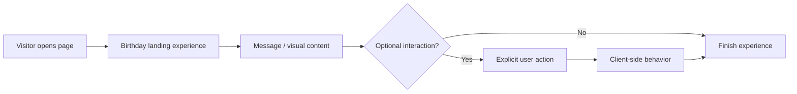
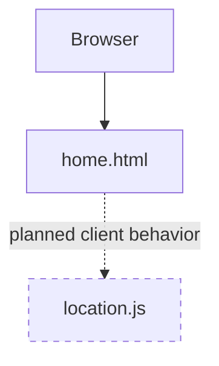
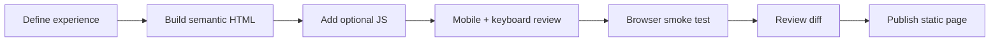

# 🎂 BirthdayGtya — Engineering Blueprint

> A source-grounded blueprint for turning the current placeholder repository into a small, polished birthday experience without pretending unfinished features already exist.

**Reviewed snapshot:** `main` @ [`d158a5e7c96c`](https://github.com/HidayahMF/BirthdayGtya/commit/d158a5e7c96c6f535ad0dfa18c6fdb126dce3da2) — 2026-09-17

## ⚡ Project pulse

| Layer | Current state |
| --- | --- |
| UI | `home.html` exists but is empty |
| Client logic | `location.js` exists but is empty |
| Backend / API | Not present |
| Database | Not present |
| Automated tests | Not present |
| CI workflow | No `.github/workflows/` found |

## 🧭 Target experience flow

The key rule for this repository is simple: **optional browser capabilities must remain explicit and user-triggered**. Nothing in the current source justifies silently requesting location or claiming a live feature exists.

## 🏗️ Current architecture

There is currently no server, API, package manifest, build tool, or database behind this diagram.

## 🗺️ Source map

| File | Responsibility | Status |
| --- | --- | --- |
| [`home.html`](https://github.com/HidayahMF/BirthdayGtya/blob/d158a5e7c96c6f535ad0dfa18c6fdb126dce3da2/home.html) | Main browser entry | Empty placeholder |
| [`location.js`](https://github.com/HidayahMF/BirthdayGtya/blob/d158a5e7c96c6f535ad0dfa18c6fdb126dce3da2/location.js) | Optional browser behavior | Empty placeholder |

## 🚀 Development → release pipeline

### Quality gates

| Gate | Pass condition |
| --- | --- |
| Content | Page contains meaningful birthday content |
| Accessibility | Interactive controls work with keyboard and have labels |
| Privacy | Sensitive browser permissions are explicit and optional |
| Responsive UI | Layout remains usable on narrow screens |
| Runtime | Page loads without console-breaking script errors |

## 🧪 Acceptance checklist

- Open the page directly in a browser and verify useful content renders.
- Test keyboard navigation through every interactive control.
- Test a narrow mobile viewport and a desktop viewport.
- Confirm scripts load without uncaught errors.
- If location behavior is added later, verify the page still works when permission is denied.

## ⚠️ Risk radar

| Risk | Why it matters | Recommended guardrail |
| --- | --- | --- |
| Empty source | There is no working product yet | Keep documentation explicit about implementation status |
| Permission UX | Browser location can feel intrusive | Ask only after clear user action and make it optional |
| No automated checks | Regressions can slip through easily | Add lightweight validation only after real implementation exists |

## 📌 What “done” looks like

A finished first version should be a small static experience that renders reliably, behaves well on mobile, and does not depend on hidden services. Add tooling only when the project actually needs it.

---

### Keeping this blueprint accurate

Update the reviewed commit and diagrams whenever the entry point, browser behavior, or deployment model changes. Planned features should stay visibly separated from implemented behavior.
