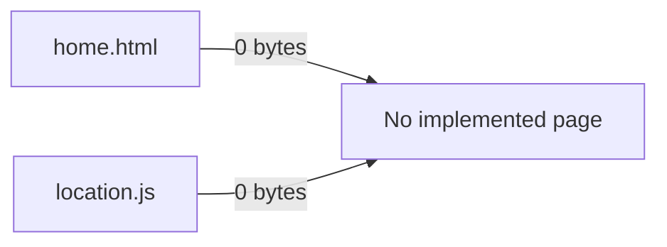
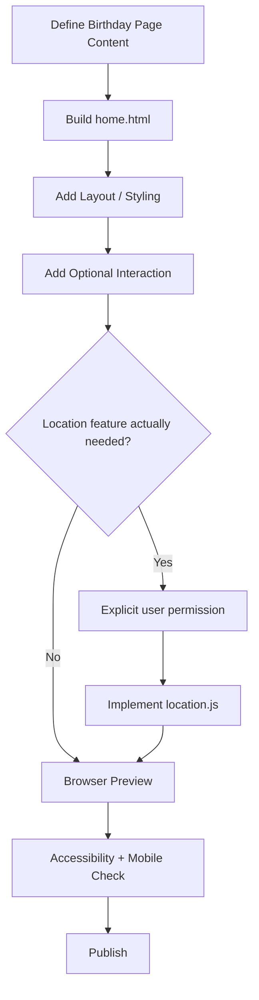
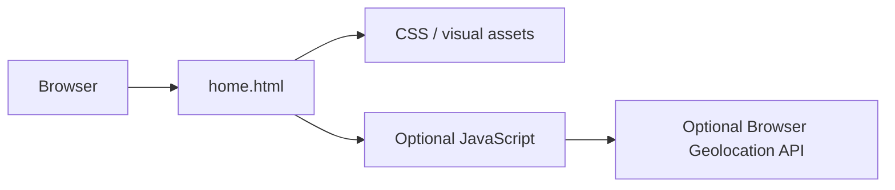
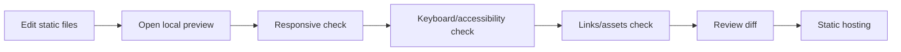
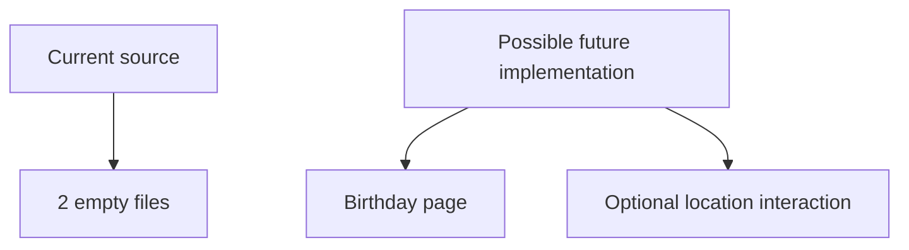

# BirthdayGtya — Development Pipeline

> Code-grounded status and implementation guide for the current repository snapshot. Reviewed from `main` at `d158a5e7c96c` on 2026-09-17.

The repository is currently a placeholder for a birthday web page. Both tracked source files are empty, so this guide separates the current state from a proposed implementation path.

## 1. Current repository state

There is no package manifest, framework runtime, build system, database, or automated test suite in the reviewed snapshot.

## 2. Proposed page pipeline

## 3. Suggested architecture if kept simple

For a small birthday page, a static HTML/CSS/JS implementation is enough unless real application requirements emerge.

## 4. Development workflow

No repository-defined commands currently exist because no package/composer manifest is present.

## 5. Verification gates

Before publishing an implementation:

- `home.html` contains meaningful content.
- Scripts load without browser console errors.
- Layout remains readable on mobile and desktop.
- Buttons/links can be used with keyboard input.
- Images and external links load correctly.
- Any location request is optional, clearly explained, and triggered only when necessary.
- The page still works when location permission is denied.

## 6. Current vs planned

Do not describe the planned page/location behavior as implemented until source code actually exists.

## 7. Source map

- [`home.html`](https://github.com/HidayahMF/BirthdayGtya/blob/d158a5e7c96c6f535ad0dfa18c6fdb126dce3da2/home.html) — empty placeholder
- [`location.js`](https://github.com/HidayahMF/BirthdayGtya/blob/d158a5e7c96c6f535ad0dfa18c6fdb126dce3da2/location.js) — empty placeholder

Update this document after real page code is introduced so the diagrams describe actual behavior rather than the proposed path.